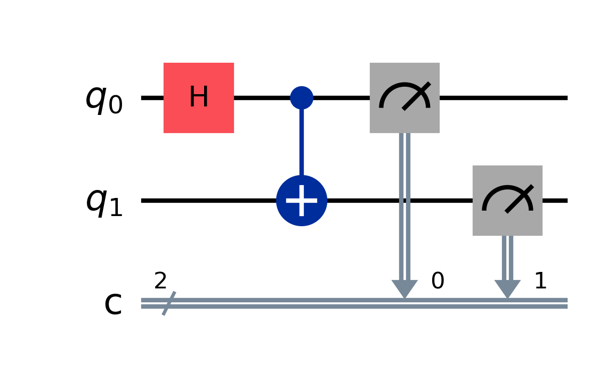
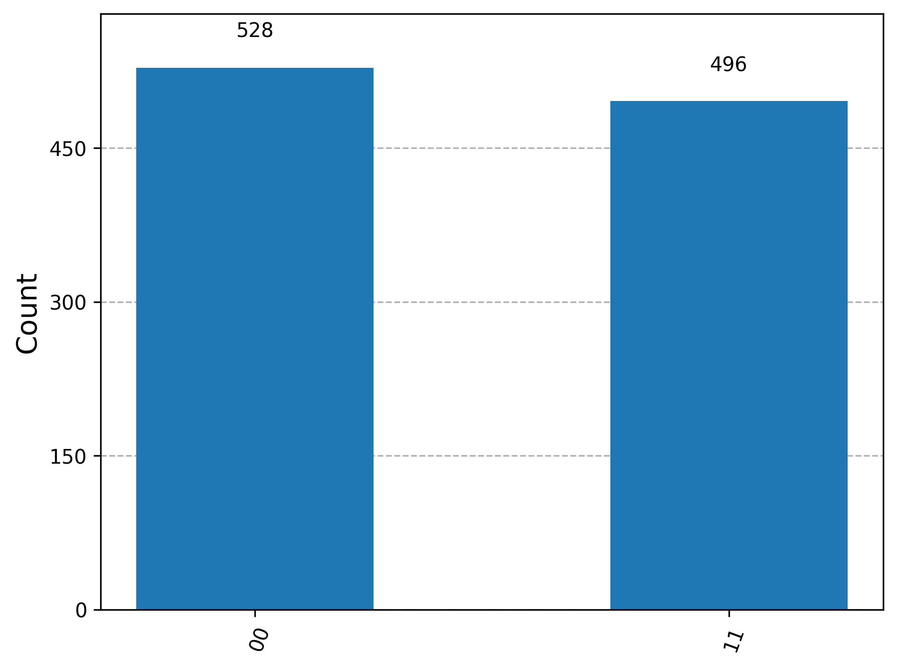
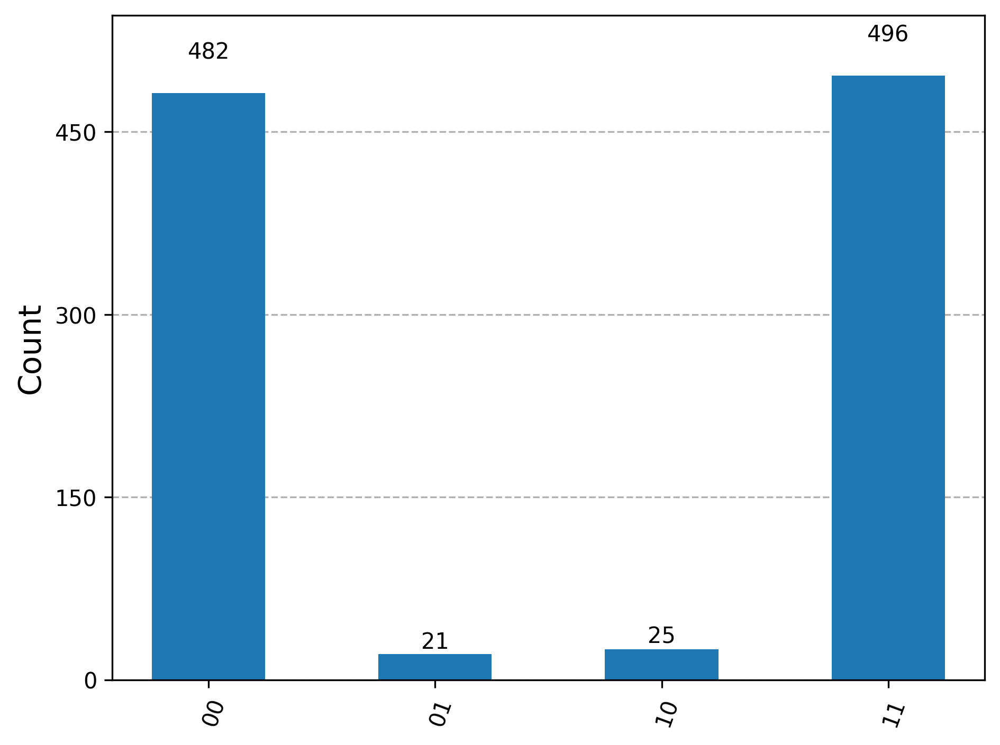
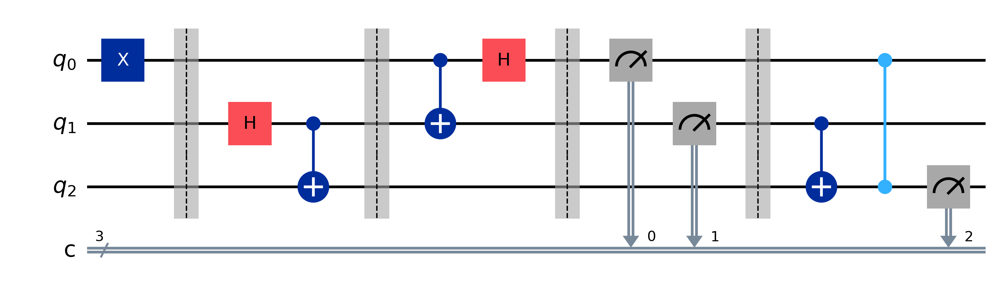
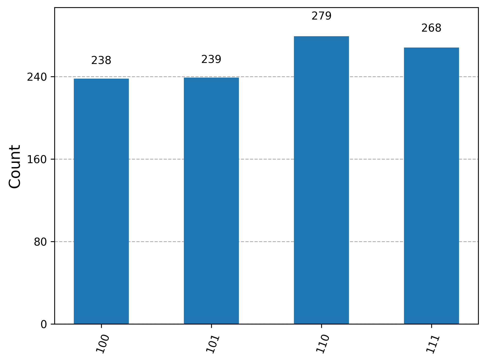
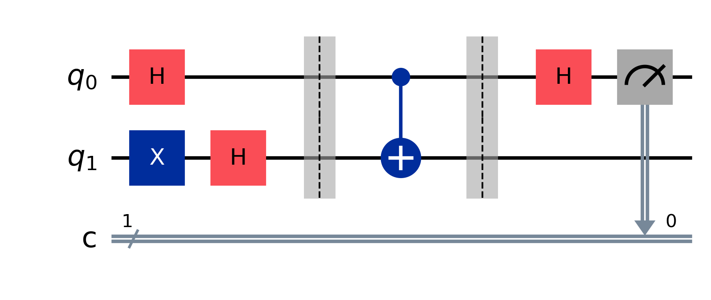
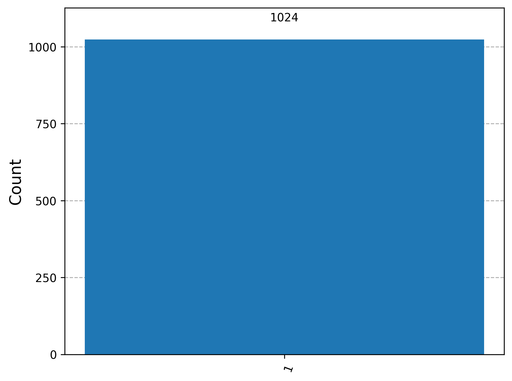

# Quantum Computing Foundations

This repository documents my practical implementations and simulations in Quantum Computing using Qiskit, complementing my academic background in **Physics**. 

The focus of this repository is to bridge the gap between theoretical quantum mechanics and hands-on quantum circuit design, showcasing scalable quantum protocols and algorithms.

---

## Repository Structure##
- [Bell_state_project.ipynb (View Code)](https://nbviewer.org/github/zghafour4-creator/Quantum-Computing-Foundations/blob/main/Bell_state_project.ipynb)
- [Quantum_Teleportation.ipynb (View Code)](https://nbviewer.org/github/zghafour4-creator/Quantum-Computing-Foundations/blob/main/Quntum_Teleportation.ipynb)
- [Deutsch_Jozsa_Algorithm.ipynb (View Code)](https://nbviewer.org/github/zghafour4-creator/Quantum-Computing-Foundations/blob/main/Deutsch_Jozsa_Algorithm.ipynb)
---

## Project 1: Bell State & Entanglement
In this project, I constructed and simulated the $|\Phi^+\rangle$ Bell state to demonstrate maximal quantum correlation and entanglement.

### Circuit Design:
- **Hadamard Gate (H):** Applied on $q_0$ to put it into a superposition state: 
  $$\ H|0\rangle = \frac{|0\rangle + |1\rangle}{\sqrt{2}} $$
- **Controlled-NOT Gate (CNOT):** Entangles $q_0$ (control) and $q_1$ (target) to generate the entangled state: 
  $$|\Phi^+\rangle = \frac{|00\rangle + |11\rangle}{\sqrt{2}}$$

#### Circuit Layout:

### Key Insights & Simulation Results:
The ideal simulation confirms a 100% correlation between the two qubits, yielding only the $|00\rangle$ and $|11\rangle$ states upon measurement with a 50/50 probability split.

#### Ideal Simulation Results:

### Advanced: Realistic Noise Modeling (NISQ Simulation)
To bridge theoretical physics with practical quantum hardware limitations, I simulated the Bell State under a realistic noise model using `FakeManilaV2` (a mock backend matching the properties of the 5-qubit IBM Quantum device).

- **Ideal vs. Noisy Execution:** While the ideal simulator yields a 100% correlation (only $|00\rangle$ and $|11\rangle$), the noisy backend introduces state preparation, gate, and measurement errors, leading to the emergence of forbidden states ($|01\rangle$ and $|10\rangle$) due to quantum decoherence.
- **Significance:** This addresses the NISQ (Noisy Intermediate-Scale Quantum) era challenges, focusing on quantum error analysis.

#### Realistic Noise Simulation Results (NISQ):

---

## Project 2: Quantum Teleportation Protocol
This project demonstrates the transmission of an unknown quantum state $|\psi\rangle$ from a sender (Alice) to a receiver (Bob) using a shared entangled EPR pair and classical communication channels.

### Protocol Pipeline & Circuit Steps:
1. **State Preparation:** Initializing the state to be teleported on $q_0$ (e.g., $|\psi\rangle = |1\rangle$).
2. **EPR Entanglement:** Generating a Bell pair shared between Alice ($q_1$) and Bob ($q_2$).
3. **Alice's Bell Measurement:** Alice performs a CNOT operation and a Hadamard gate on her qubits, followed by standard computational basis measurements.
4. **Bob's Conditional Unitary Correction:** Bob receives two classical bits and applies conditional $X$ (NOT) and $Z$ (Phase-flip) transformations to fully reconstruct the original state $|\psi\rangle$ on $q_2$.

#### Protocol Circuit Layout:

### Results Analysis:
The simulator execution yields the classical measurement outcomes. Regardless of Alice's measurement variants, Bob's final qubit state always resolves to the prepared state with **100% fidelity**, verifying the perfect execution of the protocol.

#### Execution Results:

---

## Project 3: Deutsch-Jozsa Algorithm
This project implements the Deutsch-Jozsa algorithm, demonstrating the first exemplary case of quantum speedup over classical computation. It determines whether a hidden black-box function (oracle) $f: \{0,1\}^n \rightarrow \{0,1\}$ is **constant** (outputs the same bit for all inputs) or **balanced** (outputs 0 for half the inputs and 1 for the other half).

### Mathematical Formulation & Quantum Phase Kickback:
1. **Superposition:** Input qubits are initialized into a uniform superposition using Hadamard gates ($H^{\otimes n}$).
2. **Phase Kickback:** By preparing the target qubit in the $|-\rangle$ state ($|1\rangle$ passed through a Hadamard gate), the oracle shifts the phase of the input state based on the function evaluation:
   $$U_f |x\rangle |-\rangle = (-1)^{f(x)} |x\rangle |-\rangle$$
3. **Interference:** Struck by a final round of Hadamard gates, the constructive and destructive interference isolates the function's nature.

### Execution Metrics:
- **Balanced Oracle Implementation:** The implemented circuit utilizes a $CX$ gate acting as a balanced oracle.
- **Results:** Final measurement of the input register yields $|1\rangle$ with 100% probability, perfectly identifying the balanced nature of the function in a **single query ($O(1)$)**, whereas a classical approach would require $2^{n-1} + 1$ queries in the worst case.

#### Algorithm Circuit Layout:

#### Execution Metrics:
